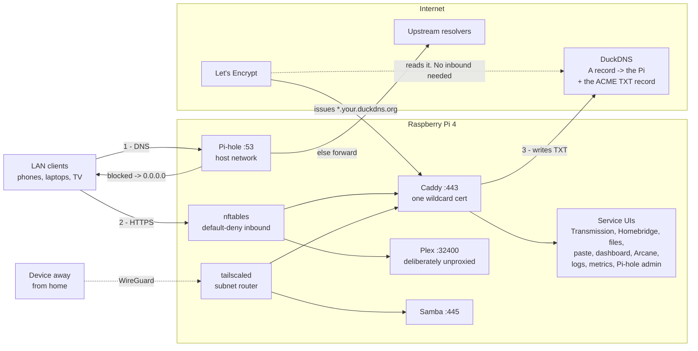
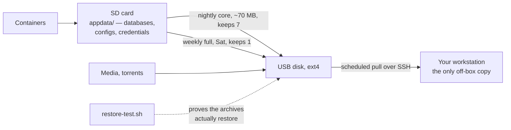

<div align="center">

# homeberry

**A self-hosted household stack for a Raspberry Pi 4.**
**LAN DNS with ad blocking, media, file access, and a real Let's Encrypt certificate on every UI — from behind CGNAT, with no inbound connectivity at all.**

[](LICENSE)
[](https://www.raspberrypi.com/products/raspberry-pi-4-model-b/)
[](https://www.raspberrypi.com/software/operating-systems/)
[](docker-compose.yml)
[](https://caddyserver.com)
[](https://letsencrypt.org)
[](https://tailscale.com)

</div>

---

This is a working setup, generalised. Every site-specific value is driven from
`.env`; nothing is hardcoded to the machine it came from. The gotchas throughout
were all hit in practice and are documented because each one cost hours.

The machine is defined by three things. Nothing is hand-configured outside them:

| | |
|---|---|
| `docker-compose.yml` | what runs |
| `provision.sh` | host setup — idempotent phases |
| `appdata/` | all mutable state (gitignored; restored from backup) |

**Running it already?** → **[docs/OPERATIONS.md](docs/OPERATIONS.md)** is the
runbook: recovery, schedules, per-service gotchas, constraints. This file is the
build manual and stops once the stack is up.

---

## 1. What you get

Twelve containers plus native Samba, grouped the way the dashboard groups them.

<div align="center">

**Media**

[](https://www.plex.tv)
[](https://transmissionbt.com)

**Files**

[](https://github.com/gtsteffaniak/filebrowser)
[](https://www.samba.org)
[](https://microbin.eu)

**Home**

[](https://homebridge.io)

**Admin**

[](https://pi-hole.net)
[](https://caddyserver.com)
[](https://github.com/getarcaneapp/arcane)
[](https://github.com/notclickable-jordan/starbase-80)

**Monitoring**

[](https://beszel.dev)
[](https://dozzle.dev)
[](https://crazymax.dev/diun/)

</div>

| Service | Image | Port | Purpose |
|---|---|---|---|
| Pi-hole | `pihole/pihole` | `53`, `8080` | LAN DNS + ad blocking. Host networking (owns `:53`) |
| Caddy | **built here** (`caddy/`) | `80`, `443` | TLS for every UI below |
| Plex | `lscr.io/linuxserver/plex` | `32400` | Media. Host networking. Deliberately **not** proxied |
| Transmission | `lscr.io/linuxserver/transmission` | `9091` | Torrents |
| Homebridge | `homebridge/homebridge` | `8581` | HomeKit bridge. Host networking (mDNS) |
| FileBrowser Quantum | `gtstef/filebrowser:stable` | `8082` | Web file manager for the data drive |
| MicroBin | `danielszabo99/microbin` | `8083` | Pastebin / small-file drop |
| starbase-80 | `jordanroher/starbase-80` | `8084` | Dashboard linking to all of the above |
| Dozzle | `amir20/dozzle` | `8085` | Live container logs |
| Beszel | `henrygd/beszel` | `8086` | Metrics, SMART history |
| Diun | `crazymax/diun` | — | Image-drift notifications |
| Arcane | `ghcr.io/getarcaneapp/manager` | `3552` | Docker web UI |
| Samba | native | `139`, `445` | SMB share of the data drive |

Plus, from `provision.sh`: nftables firewall, Tailscale (subnet router, optional),
nine Pi-hole adlists, nightly + weekly backups with an off-box pull, a container
watchdog, disk/SMART/thermal guard, scheduled `e2fsck`, and a quarterly update
job with automatic rollback.

**All images are pinned by digest.** Caddy is the one exception — it is built
here, because the official image ships no DNS provider modules, so its pin is the
`CADDY_VERSION` build arg.

### How it fits together

Two paths, and the certificate one is why this works at all: **nothing ever
connects *in* from the internet.**



The awkward part is step 3. Behind CGNAT, Let's Encrypt can never reach port 80
here, so the usual HTTP challenge is impossible. DNS-01 proves control of the
*name* instead, which needs no inbound connection — see [§7.1](#71-https-works-because-of-dns-01-not-because-anything-is-exposed).

### Where state lives, and how it survives

The SD card holds everything mutable and is the thing most likely to die.



---

## 2. Requirements

**Hardware**

- Raspberry Pi 4B, 4 GB. **64-bit Raspberry Pi OS Lite**, Debian 12 or 13.
  `provision.sh` refuses to continue on a non-arm64 userland.
- A USB disk for media, formatted **ext4**. **Required at build time** —
  `provision.sh drive` exits if it is not mounted, because every path below it
  depends on it. It is mounted `nofail`, so the Pi still boots and keeps serving
  DNS if the disk dies later; that is a different situation from not having one.
- The SD card holds `appdata/`, including Plex's SQLite DB. That is the main
  wear source and the reason the nightly backup is load-bearing. A USB SSD is
  the better answer if you have one.

**Accounts, before you start**

- A **DuckDNS** domain (free) and its token — required for HTTPS.
  `docker-compose.yml` declares `DUCKDNS_TOKEN:?`, so `docker compose up` **hard
  fails** without it. See §7 for why DuckDNS specifically.
- A plex.tv account, if you want Plex.

**Router changes — three, all mandatory, but NOT all at the same time**

⚠ Only the first is done up front. Doing 2 and 3 early is the single most
common way to make this build fail confusingly: it takes DNS away from the
machine that is still installing packages and pulling images.

1. **Before you start:** a **DHCP reservation** pinning the Pi to a fixed
   address. The address is not configured on the Pi itself, so a reimaged Pi
   returns on the same IP.
2. **After stage 2, once Pi-hole is verified:** set the **DNS handed to clients
   = the Pi's address.** This is what makes Pi-hole the LAN resolver.
3. **At the same time:** **remove any secondary DNS entry.** A second resolver
   silently breaks every Pi-hole-only name — `dig` still looks fine, because it
   queries only the first, while macOS `getaddrinfo` races both and takes the
   other one's NXDOMAIN. See [docs/OPERATIONS.md](docs/OPERATIONS.md) §7.3.

⚠ Consequence of 2 and 3: **Pi-hole becomes a single point of failure for
household DNS, with no fallback.** That is deliberate — a fallback that resolves
*some* names is worse to debug than none — but it means Pi-hole downtime takes
the internet down for everyone in the house. Before planned downtime, point the
router's DNS at `1.1.1.1`.

**Do not port-forward anything.** Not `80`, `443`, `9091`, `3552`, `8082`,
`8083`, `8085`, `8086`. See §7.3. If you want these from outside the house, that
is what Tailscale is for ([docs/OPERATIONS.md](docs/OPERATIONS.md) §7.7) — never
a port forward.

---

## 3. Configuration

Everything site-specific lives in `.env`. There is nothing to edit in the scripts
or in `docker-compose.yml`.

```bash
cp .env.example .env && chmod 600 .env
```

**Site values — set these before the first run:**

| Key | Default | Notes |
|---|---|---|
| `LAN_IP` | *none — required* | The Pi's LAN address, as a **DHCP reservation** on the router |
| `CADDY_DOMAIN` | *none — required* | Your DuckDNS name, e.g. `yourname.duckdns.org` |
| `LAN_SUBNET` | `192.168.0.0/24` | Used by the Tailscale subnet route and the disk guard |
| `LOCAL_HOSTNAME` | `raspberrypi` | Also sets the mDNS name `<hostname>.local` |
| `LOCAL_DNS_NAME` | `home.internal` | Short local A record served by Pi-hole |
| `TZ` | `Etc/UTC` | From `timedatectl list-timezones` |
| `DATA_DEV` | `/dev/sda1` | ⚠ **Verify with `lsblk`.** Used to derive `DATA_DRIVE_UUID` and to build `/etc/fstab` |
| `DATA_DRIVE_UUID` | *blank* | Leave blank — `provision.sh` detects it, asks you to confirm, and writes it back |
| `DATA_ROOT` | `/mnt/rpidata` | Bind-mounted at the same path inside containers. Fix it before first run or not at all |
| `MEDIA_SUBFOLDERS` | `music,torrent-complete,…` | Folders `fix-permissions.sh` takes ownership of |
| `TAILSCALE_AUTHKEY` | *blank* | **Optional.** Blank = stay LAN-only. Tailscale and its host settings are installed either way |
| `DOCKER_GID` | `985` | `provision.sh` derives the real one with `getent group docker` and rewrites this |

**Secrets** — all `changeme` in `.env.example`. Required before the first run,
with three exceptions called out in the table: `TAILSCALE_AUTHKEY` is optional,
`ARCANE_PASSWORD` is record-only (nothing reads it), and the two `BESZEL_*`
values cannot exist until the hub has been claimed after first boot.

| Key | How to set it |
|---|---|
| `PIHOLE_PASSWORD` | your choice. **No username** — Pi-hole v6 login is password-only |
| `PIHOLE_UPSTREAMS` | e.g. `1.1.1.1;9.9.9.9`. Semicolons, and the quotes are required |
| `SAMBA_PASSWORD` | recorded here only; Samba's real store is set by `smbpasswd` |
| `FILEBROWSER_PASSWORD` | **re-applied at every start**, so this file always wins over the UI |
| `TRANSMISSION_PASSWORD` | consumed by the linuxserver image's init. **Blank it and RPC auth silently turns off** |
| `MICROBIN_PASSWORD` | **not optional** — the default is the published `admin`/`m1cr0b1n` |
| `ARCANE_PASSWORD` | **Nothing reads this** — Arcane owns its account DB. Fresh installs start as `arcane`/`arcane-admin` and prompt on first login; record what you chose here. 12+ chars, upper + lower + digit + symbol, or Arcane rejects it |
| `DOZZLE_PASSWORD` | `provision.sh` turns this into `appdata/dozzle/users.yml` (a bcrypt hash). **Dozzle will not start without that file.** Changing this key later does nothing on its own — regenerate the file |
| `ARCANE_ENCRYPTION_KEY` | `openssl rand -hex 32`. Never rotate to fix a login — it decrypts stored registry credentials |
| `ARCANE_JWT_SECRET` | `openssl rand -hex 32` |
| `DUCKDNS_TOKEN` | from duckdns.org. Can edit DNS for your subdomain and nothing else |
| `BESZEL_KEY` / `BESZEL_TOKEN` | issued by Beszel's *Metrics → Add System*, which only exists **after** the stack is up. Leave them as-is for the first run; the `beszelagent` phase skips and tells you to re-run it. The key is public; the token is not |

```bash
# generate the two Arcane secrets straight into .env
printf 'ARCANE_ENCRYPTION_KEY=%s\nARCANE_JWT_SECRET=%s\n' \
  "$(openssl rand -hex 32)" "$(openssl rand -hex 32)" | sudo tee -a /opt/pi-stack/.env
```

⚠ Set `DUCKDNS_TOKEN` in a way that does not leave it in shell history, and
verify it is non-empty — an empty value fails compose validation in a way that
reads like a missing key:

```bash
ssh -t pi 'read -rsp "DuckDNS token: " t && \
  sudo sed -i "s|^DUCKDNS_TOKEN=.*|DUCKDNS_TOKEN=$t|" /opt/pi-stack/.env && echo && echo saved'
```

**One value is not in `.env`:** the Tailscale ACL policy
(`config/tailscale-policy.hujson.example`) is **pasted into the Tailscale admin
console**, not deployed by anything here. Replace its placeholders by hand. See
[docs/OPERATIONS.md](docs/OPERATIONS.md) §7.7.3.

---

## 4. Build

```bash
# 1. Flash Raspberry Pi OS Lite (64-bit) with Imager.
#    Advanced options: set hostname, user `pi`, and your SSH public key.
#    Verify after boot:  dpkg --print-architecture   -> arm64

# 2. Format the data drive (skip if reusing an existing ext4 disk).
#    ⚠ mkfs is irreversible. /dev/sdX is assigned in USB enumeration order, so
#    it is NOT a stable name — check MODEL and SERIAL, not just size.
lsblk -o NAME,PATH,SIZE,MODEL,SERIAL,FSTYPE,LABEL,MOUNTPOINTS

DATA_DEVICE=/dev/sdX1                  # set only after reading the above
findmnt --source "$DATA_DEVICE" && { echo "REFUSING: device is mounted"; false; }
sudo mkfs.ext4 -L RPIDATA "$DATA_DEVICE"

# 3. Copy the repo to the Pi, from your workstation.
#    rsync, not `scp -r ./*` — that glob silently drops dotfiles, so
#    .env.example never arrives and step 4 fails on a missing file.
ssh pi@<PI_IP> 'sudo mkdir -p /opt/pi-stack && sudo chown pi:pi /opt/pi-stack'
rsync -a --exclude='.git/' ./ pi@<PI_IP>:/opt/pi-stack/

# 4. Configuration and secrets — on the Pi
cd /opt/pi-stack
cp .env.example .env && chmod 600 .env
vim .env                               # see §3

# 5. STAGE 1 — host setup. ~15 min.
sudo bash provision.sh host

# 6. Reboot. NOT optional — see below.
sudo reboot

# 7. STAGE 2 — reconnect, then start the stack and install the timers.
#    First run BUILDS Caddy: ~6 min on a Pi 4. Adlists add several more.
cd /opt/pi-stack && sudo bash provision.sh services
```

⚠ **The reboot between stages is mandatory.** Three things set up in stage 1
only take effect at boot, and all three affect containers *created before* it:

- `cgroup_enable=memory` is appended to the kernel command line. Until reboot,
  every `mem_limit:` is **silently discarded** — `docker inspect` reports
  `Memory=0` and the container runs unlimited.
- AppArmor only confines containers created after it is active.
- `pi` is added to the `docker` group, and group membership is granted at
  **login** — the session that ran stage 1 does not have it, so the first
  un-sudoed `docker compose` fails on the socket.

There is deliberately no `all` stage. It would produce a stack that looks
correct and has no memory limits.

**Do not change the router's DNS until stage 2 tells you to.** Pointing clients
at an unprovisioned Pi takes DNS away from the machine that is mid-install —
`apt`, image pulls and the Caddy build all need it. The `dnscutover` phase runs
last, verifies Pi-hole actually answers before touching the host resolver, and
then prints the router instructions.

The `drive` phase stops and asks you to confirm the disk before it writes
`/etc/fstab`. It will not proceed on a placeholder UUID.

### After stage 2 — four things nothing can do for you

1. **Claim Beszel immediately** at `http://<LAN_IP>:8086`. The **first visitor
   becomes the owner**. Then *Add System*, put the key and token in `.env`, and
   run `sudo bash provision.sh beszelagent` — the credentials are issued by the
   hub, so they cannot exist before this.
2. **Change the first-run credentials**: Homebridge (`admin`/`admin`), Arcane
   (`arcane`/`arcane-admin`). Neither can be seeded from `.env` — Homebridge
   stores a PBKDF2 hash in `appdata/homebridge/auth.json` and has no key at all,
   and `ARCANE_PASSWORD` is only somewhere to write down what you chose.
3. **Approve the subnet route and paste the ACL policy** in the Tailscale admin
   console, if you joined a tailnet. Neither is settable from the host.
4. **Disable Transmission's UPnP begging.** The file does not exist until it has
   started once:

```bash
docker compose stop transmission
sudo vim appdata/transmission/settings.json    # "port-forwarding-enabled": false
docker compose start transmission
```

The default is `true`, which makes Transmission ask the router for a mapping it
can never get through CGNAT.

**Phases**, each idempotent and re-runnable alone (`sudo bash provision.sh dns`):

```
host      base drive perms docker native firewall tailscale samba dns
services  stack adlists backup maintenance quarterly watchdog heal
          beszelagent diskguard fsck dnscutover
```

**Off-box backups** — install once on a machine that is usually on:

```bash
cd mac
sed -e "s|__HOME__|$HOME|g" -e "s|__REPO__|$(cd .. && pwd)|g" \
  com.example.pi-backup-pull.plist.tmpl \
  > ~/Library/LaunchAgents/com.example.pi-backup-pull.plist
launchctl load ~/Library/LaunchAgents/com.example.pi-backup-pull.plist
launchctl start com.example.pi-backup-pull
tail ~/Library/Logs/pi-backup-pull.log
```

launchd does not expand `~` or `$HOME` inside a plist, which is why the template
carries absolute paths and has to be rendered rather than copied.

The workstation **pulls**, so the Pi holds no credentials for it.
`pull-backups.sh` uses plain `-a` and `date "+%Y-%m-%dT%H:%M:%S%z"` because macOS
ships **openrsync** and BSD `date`; `--info=stats1` and `date -Is` are GNU-only
and fail there.

---

## 5. Verify

```bash
cd /opt/pi-stack

# 1. every Compose container up and healthy (12 of them)
docker compose ps

# Native Beszel collector (SMART history + host/container metrics)
systemctl status beszel-agent

# 2. nothing failed at the systemd level — this is the ENTIRE alerting system
systemctl --failed

# 3. DNS answers, and blocks
docker exec pihole dig +short @127.0.0.1 pi.hole
docker exec pihole dig +short @127.0.0.1 doubleclick.net     # -> 0.0.0.0

# 4. a REAL certificate, not Caddy's internal CA fallback
echo | openssl s_client -connect 127.0.0.1:443 \
  -servername home.<YOUR_DOMAIN> 2>/dev/null \
  | openssl x509 -noout -issuer -subject -dates
#    The issuer must say Let's Encrypt and the dates must be current. Caddy does
#    not quietly substitute its internal CA for a public name — if issuance
#    fails you get a failed handshake or no certificate, not a working-looking
#    one. "Caddy Local Authority" here means the name did not qualify as public
#    (check CADDY_DOMAIN) rather than that ACME silently degraded.

# 5. end-to-end through the proxy
curl -sf -o /dev/null -w '%{http_code}\n' https://home.<YOUR_DOMAIN>/

# 6. memory limits are actually enforced (they are a silent no-op without the
#    cmdline change provision.sh makes — see docs/OPERATIONS.md §10)
docker inspect starbase80 --format '{{.HostConfig.Memory}}'   # -> 1073741824

# 7. firewall loaded, and Docker's own rules survived
sudo nft list table inet lanfw | head
docker exec pihole true && echo "docker networking intact"

# 8. timers armed
systemctl list-timers 'pi-*' 'appdata-*'

# 9. take a backup now and confirm it lands
sudo systemctl start appdata-backup-core.service
ls -lh "$DATA_ROOT"/backup/appdata/
```

Expected HTTP codes through Caddy: `home.` 200, `pihole.` 302→200, `files.` 200,
`paste.` 401, `torrents.` 302→401, `docker.` 200, `homebridge.` 200. The 401s are
basic auth working, not a fault.

---

## 6. Security posture — read this before you deploy

This stack is designed for a **LAN-only box behind CGNAT**, reachable remotely
only over Tailscale. Several deliberate trade-offs follow from that, and they are
wrong for any other threat model:

- **Arcane mounts the Docker socket, so its login is root on the host.** Whoever
  reaches it can stop Pi-hole (LAN DNS for the whole house), read `.env`, and
  delete the backups. `:ro` on the socket is theatre — the Docker API reads and
  writes over the same socket. Give it your strongest password.
- **MicroBin's `/upload/<id>` and `/raw/<id>` return full paste content with no
  credentials.** Only `/`, `/admin` and `/pastalist` are behind basic auth. That
  is upstream behaviour and is what makes links shareable. **Never paste secrets
  into it.**
- **Pi-hole is a single point of failure for household DNS**, with no fallback
  resolver, by design (§2).
- **The firewall does not defend against your own LAN.** Every RFC1918 source is
  accepted. It exists to survive a mis-clicked port forward, not a compromised
  device inside the house.
- **Filebrowser exposes the whole drive at `/srv`, including the backups.**
  Anyone logged in can delete them. FileBrowser Quantum's multi-source config is
  how to narrow that.
- **Dozzle shows container logs**, which routinely contain environment dumps and
  tokens in stack traces. A session there is close to reading `.env`.
- **Beszel's hub makes the first visitor the owner** until an admin account
  exists. Complete its first-run before anything else can reach it.
- **The `pi` account and every member of the host `docker` group are
  root-equivalent.** `provision.sh` adds both `pi` and the native `beszel` agent
  to that group, and docker-group access is enough to start a privileged
  container with the host filesystem mounted. Protect the SSH key accordingly,
  and treat a compromise of the Beszel agent as a host compromise.
- **Several services set their own credentials on first run and are wide open
  until you do.** Homebridge starts at `admin`/`admin`, Arcane at
  `arcane`/`arcane-admin`, and Beszel makes **the first visitor the owner**.
  Complete all three before any other device on the LAN can reach the box.
- **A shared password across services is a simplification, not a recommendation.**
  It is defensible only while the box stays LAN-only and holds nothing you would
  miss. Use distinct passwords if either stops being true.

Everything above is *why* §7.3's rule has no exceptions.

---

## 7. Decisions to understand before you build

Five choices here are non-obvious and expensive to reverse. Everything else is
in [docs/OPERATIONS.md](docs/OPERATIONS.md).

### 7.1 HTTPS works because of DNS-01, not because anything is exposed

This box has **no inbound connectivity** — the ISP uses CGNAT. It still gets a
publicly-trusted certificate, via two independent tricks:

1. `*.yourdomain.duckdns.org` is a **public DNS record pointing at a private
   address**. Public name, private destination. Publishing a name costs nothing
   and exposes nothing; only devices already inside the house can reach it.
2. The certificate is issued over **DNS-01**, which proves control of the *name*
   by writing a TXT record — not control of a reachable server. Let's Encrypt
   never connects to the Pi. **HTTP-01 can never work here.**

**This is why the provider must be DuckDNS** (or another with a TXT API).
DynDNS, No-IP and most ISP DDNS offerings expose an A record only, and are
useless for this.

**Using a different DNS provider** is a fork point, not a setting: change the
plugin in `caddy/Dockerfile` (it is compiled in with xcaddy) and the `tls dns
<provider>` directive in the `Caddyfile`. The Dockerfile asserts the plugin
linked in, because otherwise the failure happens at runtime, after `:80`/`:443`
are already bound.

### 7.2 One wildcard certificate, one Caddyfile site block

**Do not give each service its own site block.** DuckDNS stores exactly **one
TXT record per account**. Seven site blocks make Caddy order seven certificates
whose DNS-01 challenges overwrite each other's TXT record; they fail, retry, and
can exhaust Let's Encrypt's limit of **5 failed validations per hour**. Every
service is a `handle` inside a single `*.DOMAIN` block for this reason.

The `Caddyfile` carries the full reasoning inline. Read it before editing it.

### 7.3 TLS is not authorisation — never forward these ports

A trusted certificate encrypts the connection. It adds **no access control**.
This is the one rule in this repo with no exceptions:

| Port | Why forwarding it is unrecoverable |
|---|---|
| `3552` Arcane | mounts the Docker socket → **root on the host**. Can stop DNS for the house, read `.env`, delete backups |
| `8082` Filebrowser | whole drive at `/srv`, **including the backups** |
| `9091` Transmission | RPC whitelist is disabled; a shared password is all that stands there |
| `8083` MicroBin | `/raw/<id>` returns full content with **no credentials** — upstream behaviour, not configurable |
| `8085` Dozzle | container logs contain environment dumps and tokens in stack traces — a session here is **equivalent to reading `.env`** |
| `8086` Beszel | **the first visitor becomes the owner** until an admin account exists, and it inventories the whole host |
| `80` `443` Caddy | the front door to all of the above |

The nftables firewall drops non-RFC1918 sources, so an accidental forward is
caught — but it is a backstop, not the control. It also does **not** defend
against a compromised device on your own LAN; that device is inside the allowed
set.

Under CGNAT a forward would not work anyway. **Do not let that be the reason it
stays closed** — CGNAT is the ISP's decision to reverse, not yours.

### 7.4 Updates are gated, never continuous

`quarterly-update.sh` takes a full backup, simulates the apt upgrade and skips it
if it wants to *remove* anything, re-pins each image to the current digest of its
own channel tag, health-checks everything for 5 minutes, and **restores the
previous compose file and images automatically on any failure.**

**Do not add Watchtower.** Not automatic-vs-manual: it pulls continuously with no
backup, no health gate and no way back, so a bad image leaves the house without
DNS until somebody notices.

### 7.5 DNS bypass cannot be enforced from the Pi

If the Pi is **not** the LAN's gateway — it usually isn't; the router is — then
it never sees a packet addressed to `8.8.8.8`.

⚠ **The universal advice, an nftables/iptables `REDIRECT` of port 53 to Pi-hole,
is a no-op on this topology.** The rule loads, the ruleset looks right, and it
catches nothing. Enforcement lives at the router or nowhere.

What this stack does instead is remove the *bootstrap*: 18 `server=/domain/`
lines in `FTLCONF_misc_dnsmasq_lines` return NXDOMAIN for the major DoH/DoT
rendezvous hostnames, plus an adlist for the long tail. A client that must
resolve `dns.google` before it can speak DoH to it never gets an answer.

That stops the **opportunistic** case — a browser or OS auto-upgrading itself.
It does **not** stop a hardcoded resolver IP, and nothing on the Pi will.
Trade-off: Chrome's "Secure DNS", iCloud Private Relay and NextDNS stop working
for everyone. [docs/OPERATIONS.md](docs/OPERATIONS.md) §7.6 has the full
reasoning and how to undo it.

---

## 8. Layout

```
/opt/pi-stack
├─ docker-compose.yml           what runs
├─ .env                         config + secrets, mode 600  (gitignored)
├─ .env.example                 every key, with reasoning
├─ Caddyfile                    routing + TLS reasoning
├─ provision.sh                 host setup, phased
├─ beszel-agent-version         native agent release pin
├─ caddy/
│  └─ Dockerfile                the one built image
├─ config/
│  ├─ nftables.conf                    → /etc/nftables.conf
│  ├─ nftables-service-override.conf   → nftables.service.d/
│  ├─ samba-tailscale-ordering.conf
│  ├─ ssh-hardening.conf               → sshd_config.d/
│  ├─ filebrowser-config.yaml
│  ├─ pihole-adlists.txt               declarative adlists -> gravity.db
│  ├─ starbase80-config.json.tmpl      dashboard links; rendered by provision.sh
│  └─ tailscale-policy.hujson.example  → PASTED into the Tailscale admin
│                                        console, not deployed. Drifts silently
├─ scripts/
│  ├─ backup-appdata.sh         restore-test.sh
│  ├─ container-watchdog.sh     disk-guard.sh
│  ├─ maintenance.sh            quarterly-update.sh
│  ├─ fsck-datadrive.sh         fix-permissions.sh
│  └─ install-beszel-agent.sh   checksum-verified native agent installer
├─ mac/
│  ├─ pull-backups.sh           off-box backup pull (runs on the workstation)
│  └─ com.example.pi-backup-pull.plist.tmpl
├─ docs/
│  └─ OPERATIONS.md             the runbook
└─ appdata/                     ALL MUTABLE STATE          (gitignored)
   ├─ pihole/etc/               config, gravity DB, adlists
   ├─ plex/                     library DB, watch state, metadata
   ├─ transmission/             settings.json, resume data
   ├─ filebrowser/              config.yaml + database.db
   ├─ arcane/                   arcane.db = users + settings
   ├─ caddy/                    certificates + ACME account key
   ├─ starbase80/               rendered config.json + icons
   └─ homebridge/               config.json, auth.json, HomeKit pairings

$DATA_ROOT                      the USB disk
├─ music/  torrent-complete/  torrent-inprogress/  ftp/
└─ backup/
   ├─ appdata/                  core x7 nightly, full x1 weekly
   └─ quarterly-update.log
```

The compose project is named `pi-stack` and the deploy path is `/opt/pi-stack`.
Both are cosmetic; changing them means updating the unit files `provision.sh`
writes, so it is not a one-line rename.

**After each quarterly run the Pi's `docker-compose.yml` is authoritative** — the
job rewrites digests and the `CADDY_VERSION` arg in place. Copy it back to your
clone or the two drift.

---

## 9. License

MIT — see [LICENSE](LICENSE).

No warranty. Read `Caddyfile` and `provision.sh` before running them on anything
you care about.
