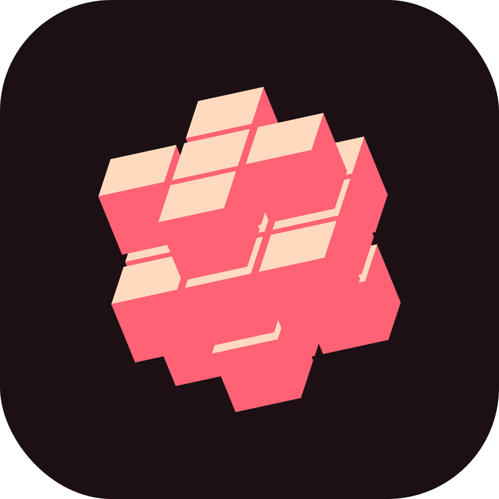
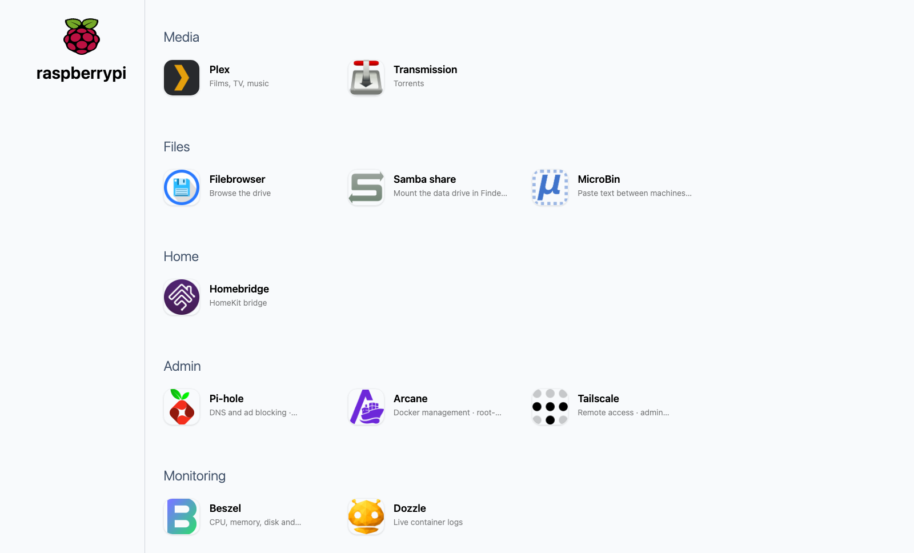
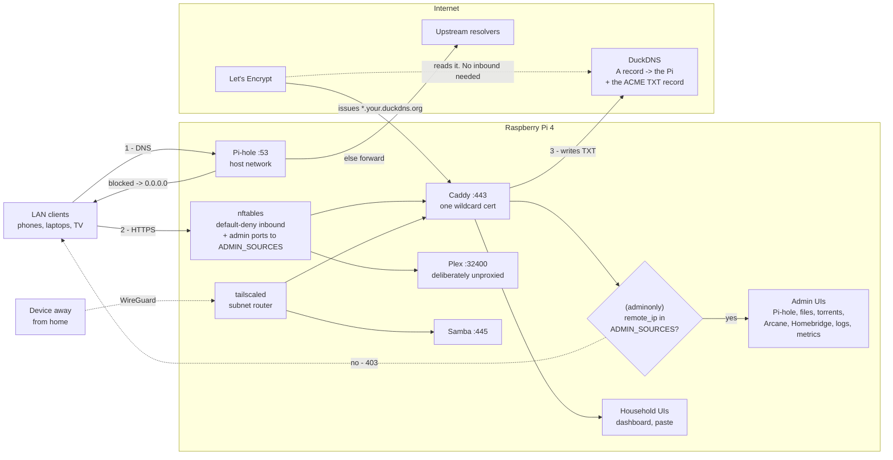
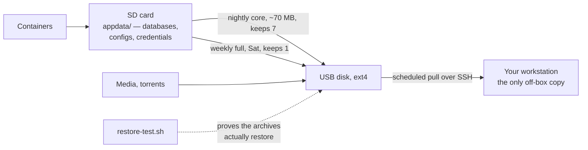

<div align="center">



# homeberry

**A self-hosted household stack for a Raspberry Pi 4.**
**LAN DNS with ad blocking, media, file access, and a real Let's Encrypt certificate on every UI — from behind CGNAT, with no inbound connectivity at all.**

[](LICENSE)
[](https://www.raspberrypi.com/products/raspberry-pi-4-model-b/)
[](https://www.raspberrypi.com/software/operating-systems/)
[](docker-compose.yml)
[](https://caddyserver.com)
[](https://letsencrypt.org)
[](https://tailscale.com)

</div>

<p align="center">
  
</p>
<p align="center"><em>The live Starbase 80 homepage — one clean entry point for the household stack.</em></p>

---

This is a general-purpose working setup. Set every site-specific value in
`.env`. Do not hardcode site values elsewhere.

Three items define the host. Do not configure the host outside these items:

| | |
|---|---|
| `docker-compose.yml` | what runs |
| `provision.sh` | host setup — idempotent phases |
| `appdata/` | all mutable state (gitignored; restored from backup) |

**Already running it?** Read **[docs/OPERATIONS.md](docs/OPERATIONS.md)** for
recovery, schedules, service limits, and daily operations. This file ends when
the stack starts.

---

## 1. What you get

The stack has thirteen services and native Samba. The dashboard uses these
groups. Fifteen containers run in total. Two `docker-socket-proxy` containers
have no UI. See [Security posture](#6-security-posture--read-this-before-you-deploy).

| | Service | Image | Port | Purpose |
|---|---|---|---|---|
| **Media** | [](https://www.plex.tv) | `lscr.io/linuxserver/plex` | `32400` | Films, TV, music. Host networking. Deliberately **not** proxied |
| | [](https://transmissionbt.com) | `lscr.io/linuxserver/transmission` | `9091` | Torrents |
| **Files** | [](https://github.com/gtsteffaniak/filebrowser) | `gtstef/filebrowser:stable` | `8082` | Web file manager for the data drive |
| | [](https://www.samba.org) | native, not a container | `139`, `445` | SMB share of the data drive |
| | [](https://microbin.eu) | `danielszabo99/microbin` | `8083` | Paste text and small files between machines |
| **Home** | [](https://homebridge.io) | `homebridge/homebridge` | `8581` | HomeKit bridge. Host networking (mDNS) |
| **Admin** | [](https://pi-hole.net) | `pihole/pihole` | `53`, `8080` | LAN DNS + ad blocking. Host networking (owns `:53`) |
| | [](https://www.authelia.com/) | `authelia/authelia:4.39` | `8087` → `9091` | Forward-auth + mandatory TOTP for every admin vhost |
| | [](https://caddyserver.com) | **built here** (`caddy/`) | `80`, `443` | Wildcard TLS for every UI in this table |
| | [](https://github.com/getarcaneapp/arcane) | `ghcr.io/getarcaneapp/manager` | `3552` | Docker web UI. **Root-equivalent** — treat as such |
| | [](https://github.com/notclickable-jordan/starbase-80) | `jordanroher/starbase-80` | `8084` | Dashboard linking to everything above |
| **Monitoring** | [](https://beszel.dev) | `henrygd/beszel` | `8086` | CPU, memory, disk, SMART history |
| | [](https://dozzle.dev) | `amir20/dozzle` | `8085` | Live container logs |
| | [](https://crazymax.dev/diun/) | `crazymax/diun` | — | Notifies when an image goes stale |

**The Port column shows the container port. It does not show a LAN address.**
Only `53`, `80`, `443`, `8080`, `8581`, `32400`, and Samba publish beyond
`127.0.0.1` (`BIND_ADDR`). Use `https://<service>.<your-domain>` through Caddy.
See [Security posture](#6-security-posture--read-this-before-you-deploy).

`provision.sh` creates the nftables firewall and optional Tailscale subnet
router. It also creates nine Pi-hole adlists, backups, monitoring guards,
scheduled `e2fsck`, and a quarterly update job with rollback.

**All images use digest pins.** Caddy is built locally because the official
image has no DNS provider modules. Its build pin is `CADDY_VERSION`.

### How it fits together

The stack has two access paths. **Nothing accepts an inbound internet
connection.** DNS-01 provides the certificate path.



Step 3 writes the DNS proof. CGNAT prevents Let's Encrypt from reaching port 80.
DNS-01 proves control of the *name* without an inbound connection. See
[docs/DECISIONS.md](docs/DECISIONS.md#https-works-because-of-dns-01-not-because-anything-is-exposed).

### Where state lives, and how it survives

The SD card stores all mutable state. It is the most likely storage failure.



---

## 2. Requirements

**Hardware**

- Raspberry Pi 4B, 4 GB. Use **64-bit Raspberry Pi OS Lite**, Debian 12 or 13.
  `provision.sh` stops on a non-arm64 userland.
- Use an **ext4** USB disk for media. It is **required during the build**.
  `provision.sh drive` stops if it is not mounted. All paths below depend on it.
  The `nofail` mount lets the Pi boot and serve DNS after a later disk failure.
- The SD card stores `appdata/`, including the Plex SQLite DB. This causes the
  most wear. A USB SSD reduces that risk.

**Accounts, before you start**

- A **DuckDNS** domain and token are required for HTTPS.
  `docker-compose.yml` declares `DUCKDNS_TOKEN:?`. `docker compose up` **fails**
  without it. See [docs/DECISIONS.md](docs/DECISIONS.md) for the DuckDNS choice.
- A plex.tv account, if you want Plex.
- A TOTP authenticator on a phone. Caddy blocks admin vhosts until user `pi`
  completes enrolment after the first start.

**Router changes — three, all mandatory, but NOT all at the same time**

⚠ Do only step 1 before the build. Steps 2 and 3 remove DNS from a host that
still installs packages and pulls images.

1. **Before you start:** a **DHCP reservation** pinning the Pi to a fixed
   address. Do not configure this address on the Pi. A reimaged Pi returns with
   the same IP.
2. **After stage 2, once Pi-hole is verified:** set the **DNS handed to clients
   = the Pi's address.** This makes Pi-hole the LAN resolver.
3. **At the same time:** **remove any secondary DNS entry.** A second resolver
   silently breaks Pi-hole-only names. `dig` queries only the first resolver.
   macOS `getaddrinfo` races both and can use the other NXDOMAIN. See
   [docs/services/apps.md](docs/services/apps.md#dashboard-starbase-80).

⚠ Steps 2 and 3 make **Pi-hole the single point of failure for household DNS.**
There is no fallback resolver. Pi-hole downtime stops internet access for the
household. Before planned downtime, set the router DNS to `1.1.1.1`.

**Do not port-forward anything.** Not `80`, `443`, `9091`, `3552`, `8082`,
`8083`, `8085`, `8086`. See [docs/DECISIONS.md](docs/DECISIONS.md#tls-is-not-authorisation--never-forward-these-ports). If you want these from outside the house,
use Tailscale ([docs/services/network.md](docs/services/network.md#tailscale-remote-access)). Never use a port forward.

---

## 3. Configuration

Set all site-specific values in `.env`. Do not edit scripts or
`docker-compose.yml`.

```bash
cp .env.example .env && chmod 600 .env
```

**Set these site values before the first run:**

| Key | Default | Notes |
|---|---|---|
| `LAN_IP` | *none — required* | The Pi's LAN address, as a **DHCP reservation** on the router |
| `CADDY_DOMAIN` | *none — required* | Your DuckDNS name, e.g. `yourname.duckdns.org` |
| `LAN_SUBNET` | `192.168.0.0/24` | Used by the Tailscale subnet route and the disk guard |
| `LOCAL_HOSTNAME` | `raspberrypi` | Also sets the mDNS name `<hostname>.local` |
| `LOCAL_DNS_NAME` | `home.internal` | Short local A record served by Pi-hole |
| `PIHOLE_EXTRA_HOSTS` | *blank* | Semicolon-separated A/PTR records for DHCP-reserved devices; keep the real inventory only in `.env` |
| `CADDY_HOST_SUBNET`, `CADDY_HOST_GATEWAY`, `CADDY_HOST_IP` | `172.22.0.0/29`, `.1`, `.2` | Dedicated Caddy-to-host path; `provision.sh stack` validates the set and rejects Docker-network overlap |
| `TZ` | `Etc/UTC` | From `timedatectl list-timezones` |
| `DATA_DEV` | `/dev/sda1` | ⚠ **Verify with `lsblk`.** Used to derive `DATA_DRIVE_UUID` and to build `/etc/fstab` |
| `DATA_DRIVE_UUID` | *blank* | Leave blank — `provision.sh` detects it, asks you to confirm, and writes it back |
| `DATA_ROOT` | `/mnt/rpidata` | Bind-mounted at the same path inside containers. Fix it before first run or not at all |
| `MEDIA_SUBFOLDERS` | `music,torrent-complete,…` | Folders `fix-permissions.sh` takes ownership of |
| `TAILSCALE_AUTHKEY` | *blank* | **Optional.** Blank = stay LAN-only. Tailscale and its host settings are installed either way |
| `DOCKER_GID` | `985` | `provision.sh` derives the real one with `getent group docker` and rewrites this |

**Secrets:** Replace every `changeme` value in `.env.example` before the first
run. `TAILSCALE_AUTHKEY` is optional. `ARCANE_PASSWORD` is record-only. Create
the two `BESZEL_*` values after you claim the hub.

| Key | How to set it |
|---|---|
| `PIHOLE_PASSWORD` | your choice. **No username** — Pi-hole v6 login is password-only |
| `PIHOLE_UPSTREAMS` | e.g. `1.1.1.1;9.9.9.9`. Semicolons, and the quotes are required |
| `SAMBA_PASSWORD` | recorded here only; Samba's real store is set by `smbpasswd` |
| `FILEBROWSER_PASSWORD` | **re-applied at every start**, so this file always wins over the UI |
| `TRANSMISSION_PASSWORD` | consumed by the linuxserver image's init. **Blank it and RPC auth silently turns off** |
| `MICROBIN_PASSWORD` | **not optional** — the default is the published `admin`/`m1cr0b1n` |
| `ARCANE_PASSWORD` | **Nothing reads this** — Arcane owns its account DB. Fresh installs start as `arcane`/`arcane-admin` and prompt on first login; record what you chose here. 12+ chars, upper + lower + digit + symbol, or Arcane rejects it |
| `DOZZLE_PASSWORD` | `provision.sh` turns this into `appdata/dozzle/users.yml` (a bcrypt hash). **Dozzle will not start without that file.** Changing this key later does nothing on its own — regenerate the file |
| `ARCANE_ENCRYPTION_KEY` | `openssl rand -hex 32`. Never rotate to fix a login — it decrypts stored registry credentials |
| `ARCANE_JWT_SECRET` | `openssl rand -hex 32` |
| `AUTHELIA_PASSWORD` | login for user `pi`; defaults to the knowingly shared LAN value `raspberry` and is re-applied by `provision.sh authelia` |
| `AUTHELIA_JWT_SECRET` / `AUTHELIA_SESSION_SECRET` / `AUTHELIA_STORAGE_ENCRYPTION_KEY` | three independent values, each from `openssl rand -hex 32`; never rotate the storage key in place |
| `DUCKDNS_TOKEN` | from duckdns.org. Can edit DNS for your subdomain and nothing else |
| `BESZEL_KEY` / `BESZEL_TOKEN` | issued by Beszel's *Metrics → Add System*, which only exists **after** the stack is up. Leave them as-is for the first run; the `beszelagent` phase skips and tells you to re-run it. The key is public; the token is not |

```bash
# generate the two Arcane secrets straight into .env
printf 'ARCANE_ENCRYPTION_KEY=%s\nARCANE_JWT_SECRET=%s\n' \
  "$(openssl rand -hex 32)" "$(openssl rand -hex 32)" | sudo tee -a /opt/pi-stack/.env
```

⚠ Set `DUCKDNS_TOKEN` without recording it in shell history. Verify that it is
non-empty. An empty value fails compose validation as a missing key:

```bash
ssh -t pi 'read -rsp "DuckDNS token: " t && \
  sudo sed -i "s|^DUCKDNS_TOKEN=.*|DUCKDNS_TOKEN=$t|" /opt/pi-stack/.env && echo && echo saved'
```

**One value is not in `.env`:** Paste the Tailscale ACL policy
(`config/tailscale-policy.hujson.example`) into the Tailscale admin console.
Nothing deploys it. Replace its placeholders manually. See
[docs/services/network.md](docs/services/network.md#access-control-acls).

---

## 4. Build

```bash
# 1. Use Imager to flash Raspberry Pi OS Lite (64-bit).
#    Set the hostname, user `pi`, and SSH public key in Advanced options.
#    After boot, verify:  dpkg --print-architecture   -> arm64

# 2. ⚠ This command removes all data on the selected drive. Skip this step when
#    reusing an ext4 disk. `mkfs` is irreversible. `/dev/sdX` changes with USB
#    enumeration. Check MODEL and SERIAL. Do not check size only.
lsblk -o NAME,PATH,SIZE,MODEL,SERIAL,FSTYPE,LABEL,MOUNTPOINTS

DATA_DEVICE=/dev/sdX1                  # Set this only after you check the list.
findmnt --source "$DATA_DEVICE" && { echo "REFUSING: device is mounted"; false; }
sudo mkfs.ext4 -L RPIDATA "$DATA_DEVICE"

# 3. Copy the repository from the workstation to the Pi.
#    ⚠ Do not use `scp -r ./*`. It silently drops dotfiles. Then
#    `.env.example` is absent and step 4 fails.
ssh pi@<PI_IP> 'sudo mkdir -p /opt/pi-stack && sudo chown pi:pi /opt/pi-stack'
rsync -a --exclude='.git/' ./ pi@<PI_IP>:/opt/pi-stack/

# 4. Set configuration and secrets on the Pi.
cd /opt/pi-stack
cp .env.example .env && chmod 600 .env
vim .env                               # See section 3.

# 5. Run STAGE 1 for host setup. ~15 min.
sudo bash provision.sh host

# 6. Reboot. This is mandatory. See below.
sudo reboot

# 7. Reconnect. Run STAGE 2 to start the stack and install timers.
#    The first run BUILDS Caddy: ~6 min on a Pi 4. Adlists add more time.
cd /opt/pi-stack && sudo bash provision.sh services
```

⚠ **The reboot between stages is mandatory.** Stage 1 creates three settings
that apply only after boot. Each setting affects containers created before boot:

- `cgroup_enable=memory` is added to the kernel command line. Before reboot,
  every `mem_limit:` is **silently discarded**. `docker inspect` reports
  `Memory=0`. The container has no memory limit.
- AppArmor confines only containers created after AppArmor is active.
- `pi` joins the `docker` group at **login**. The stage 1 session lacks that
  membership. Its first un-sudoed `docker compose` fails on the socket.

There is no `all` stage. It would create a stack without memory limits.

**Do not change the router DNS until stage 2 tells you.** An unprovisioned Pi
cannot provide DNS during installation. `apt`, image pulls, and the Caddy build
need DNS. `dnscutover` runs last. It verifies Pi-hole before it changes the host
resolver. It then prints router instructions.

The `drive` phase requires disk confirmation before it writes `/etc/fstab`.
It stops on a placeholder UUID.

### After stage 2 — five things nothing can do for you

1. **Enrol TOTP for Authelia.** Open `https://auth.<YOUR_DOMAIN>/`, sign in as
   `pi` with `AUTHELIA_PASSWORD` from `.env`. Request registration. Then print
   the filesystem notification:

```bash
ssh pi 'sudo cat /opt/pi-stack/appdata/authelia/notification.txt'
```

   Open the newest link. Scan the QR code. Until you complete this task, every
   admin vhost is blocked. Use SSH and loopback break-glass ports.
2. **Claim Beszel immediately** at `http://<LAN_IP>:8086`. The **first visitor
   becomes the owner**. Select *Add System*. Put the key and token in `.env`.
   Run `sudo bash provision.sh beszelagent`. The hub issues these credentials.
3. **Change the first-run credentials**: Homebridge (`admin`/`admin`), Arcane
   (`arcane`/`arcane-admin`). Do not seed either from `.env`. Homebridge stores
   a PBKDF2 hash in `appdata/homebridge/auth.json`. `ARCANE_PASSWORD` only
   records the password you select.
4. **Approve the subnet route.** Paste the ACL policy in the Tailscale admin
   console if you joined a tailnet. The host cannot set either item.
5. **Disable Transmission UPnP.** The file exists only after the first start:

```bash
docker compose stop transmission
sudo vim appdata/transmission/settings.json    # "port-forwarding-enabled": false
docker compose start transmission
```

The default is `true`. Transmission then asks the router for a mapping that
CGNAT cannot provide.

**Phases:** Each phase is idempotent. Run a phase alone with
`sudo bash provision.sh dns`.

```
host      base drive perms docker native firewall tailscale samba dns
services  authelia stack arcane adlists backup maintenance quarterly watchdog heal
          beszelagent diskguard fsck dnscutover
```

**Off-box backups:** Install once on a workstation that is usually on:

```bash
cd mac
sed -e "s|__HOME__|$HOME|g" -e "s|__REPO__|$(cd .. && pwd)|g" \
  com.example.pi-backup-pull.plist.tmpl \
  > ~/Library/LaunchAgents/com.example.pi-backup-pull.plist
launchctl load ~/Library/LaunchAgents/com.example.pi-backup-pull.plist
launchctl start com.example.pi-backup-pull
tail ~/Library/Logs/pi-backup-pull.log
```

launchd does not expand `~` or `$HOME` inside a plist. Render the template with
absolute paths. Do not copy it directly.

The workstation **pulls** backups. The Pi stores no workstation credentials.
`pull-backups.sh` uses plain `-a` and `date "+%Y-%m-%dT%H:%M:%S%z"`. macOS ships
**openrsync** and BSD `date`. `--info=stats1` and `date -Is` require GNU tools.

---

## 5. Verify

```bash
cd /opt/pi-stack

# 1. every Compose container up and healthy (15 of them)
docker compose ps

# Native Beszel collector (SMART history + host/container metrics)
systemctl status beszel-agent

# 2. nothing failed at the systemd level — this is the ENTIRE alerting system
systemctl --failed

# 3. DNS answers, and blocks
docker exec pihole dig +short @127.0.0.1 pi.hole
docker exec pihole dig +short @127.0.0.1 doubleclick.net     # -> 0.0.0.0

# 4. a REAL certificate, not Caddy's internal CA fallback
echo | openssl s_client -connect 127.0.0.1:443 \
  -servername home.<YOUR_DOMAIN> 2>/dev/null \
  | openssl x509 -noout -issuer -subject -dates
#    The issuer must say Let's Encrypt and the dates must be current. Caddy does
#    not quietly substitute its internal CA for a public name — if issuance
#    fails you get a failed handshake or no certificate, not a working-looking
#    one. "Caddy Local Authority" here means the name did not qualify as public
#    (check CADDY_DOMAIN) rather than that ACME silently degraded.

# 5. auth portal and forward-auth boundary
curl -sf -o /dev/null -w '%{http_code}\n' https://auth.<YOUR_DOMAIN>/   # 200
curl -sS -o /dev/null -w '%{http_code} %{redirect_url}\n' \
  https://files.<YOUR_DOMAIN>/                                          # redirect to auth.

# 6. household bypass remains open
curl -sf -o /dev/null -w '%{http_code}\n' https://home.<YOUR_DOMAIN>/

# 7. memory limits are actually enforced (they are a silent no-op without the
#    cmdline change provision.sh makes — see docs/OPERATIONS.md#10-constraints)
docker inspect starbase80 --format '{{.HostConfig.Memory}}'   # -> 1073741824

# 8. firewall loaded, and Docker's own rules survived
sudo nft list table inet lanfw | head
docker exec pihole true && echo "docker networking intact"

# 9. timers armed
systemctl list-timers 'pi-*' 'appdata-*'

# 10. take a backup now and confirm it lands
sudo systemctl start appdata-backup-core.service
ls -lh "$DATA_ROOT"/backup/appdata/
```

Before login, `auth.` and `home.` return 200. `paste.` keeps its own 401.
Every admin name redirects to `auth.`. After TOTP enrolment and login, the
seven admin names reach their service login. Keep those logins as defence in
depth.

---

## 6. Security posture — read this before you deploy

This stack is for a **LAN-only host behind CGNAT**. Use Tailscale for remote
access only. These choices are wrong for another threat model:

- **Arcane login remains root-equivalent behind the socket proxy.** No container
  mounts `/var/run/docker.sock` directly. Arcane, Dozzle, and Diun use a
  [`docker-socket-proxy`](https://github.com/Tecnativa/docker-socket-proxy)
  with endpoint allowlists. `EXEC` is off for both proxies. `POST` is off for
  the read-only proxy. A service that can create a container can mount `/`.
  Set `SOCKET_PROXY_POST=0` to make Arcane read-only. Use your strongest
  password either way.
- **Diun monitors image updates automatically.** Arcane image polling is off
  in persistent settings. This prevents duplicate registry checks. You can run
  the Arcane check manually. The quarterly updater changes digests after backup
  and health checks.
- **MicroBin `/upload/<id>` and `/raw/<id>` return full paste content without
  credentials.** Only `/`, `/admin`, and `/pastalist` use basic auth. This is
  upstream behavior and makes links shareable. **Never paste secrets into it.**
- **Pi-hole is the single failure point for household DNS.** It has no fallback
  resolver. See [Requirements](#2-requirements).
- **LAN defence is opt-in and starts off.** The outer tier drops every
  non-private source. It is always on and blocks an accidental port forward.
  The inner tier limits admin access with `ADMIN_SOURCES`. Its default is all
  RFC1918 addresses. **Until you narrow it, a compromised TV or IoT bulb has
  the same access as you.** Set the workstation in `.env` to limit both tiers:

  | | Enforced by | Covers |
  |---|---|---|
  | Layer 4 | `config/nftables.conf` `$admin_sources` | `22` SSH, `8080` Pi-hole, `8581` Homebridge |
  | Layer 7 | `Caddyfile` `(adminonly)` | `pihole` `files` `torrents` `docker` `homebridge` `logs` `metrics` vhosts |

  Caddy performs the second tier. Every vhost arrives on `:443` and layer 4
  cannot distinguish them. The tailnet is always admin. nftables admits
  `tailscale0` by interface. Caddy allows `100.64.0.0/10`. These remain open:
  dashboard, pastebin, Plex, DNS, Samba, and BitTorrent.

  This is a **reachability tier, not authentication**. Every service has its
  own password. Read the deadman-switch note in `.env.example` before you
  narrow access. A Pi has no serial console.
- **Admin UIs have no LAN port access.** `BIND_ADDR` publishes them only on
  `127.0.0.1`. Caddy is the access chokepoint. Use an ssh tunnel for break-glass
  access (`ssh -N -L 8085:127.0.0.1:8085 pi@<ip>`). `BIND_ADDR=0.0.0.0` makes
  `ADMIN_SOURCES` decorative.
- **Every admin vhost requires Authelia two-factor authentication.** The IP
  allowlist runs first. Each backend keeps its own login. If Authelia fails,
  these names fail closed with 502. Use SSH and loopback ports for break-glass
  access. The portal uses `8087`.
- **Filebrowser exposes the complete drive at `/srv`, including backups.** Any
  logged-in user can remove them. Use FileBrowser Quantum multi-source config
  to limit access.
- **Dozzle shows container logs.** Logs can contain environment dumps and stack
  trace tokens. A Dozzle session is close to reading `.env`.
- **Beszel makes the first visitor the owner** until an admin account exists.
  Complete the first run before another device reaches it.
- **The `pi` account and every host `docker` group member are root-equivalent.**
  `provision.sh` adds `pi` and the native `beszel` agent to that group. Docker
  group access can start a privileged container with the host filesystem
  mounted. Protect the SSH key. Treat a Beszel agent compromise as host
  compromise.
- **Several services have first-run credentials and are open until you change
  them.** Homebridge starts as `admin`/`admin`. Arcane starts as
  `arcane`/`arcane-admin`. Beszel makes **the first visitor the owner**. Complete
  all three before another LAN device reaches the host.
- **A shared service password is a simplification, not a recommendation.** Use
  distinct passwords if the host is not LAN-only or stores valuable data.

This is why the rule in [docs/DECISIONS.md](docs/DECISIONS.md#tls-is-not-authorisation--never-forward-these-ports) has no exceptions.

---

## 7. Decisions to understand before you build

Read [docs/DECISIONS.md](docs/DECISIONS.md) before you build. It records the
five expensive-to-reverse choices. Read [docs/OPERATIONS.md](docs/OPERATIONS.md)
for all other operating detail.
---

## 8. Layout

```
/opt/pi-stack
├─ docker-compose.yml           what runs
├─ .env                         config + secrets, mode 600  (gitignored)
├─ .env.example                 every key, with reasoning
├─ Caddyfile                    routing + TLS reasoning
├─ provision.sh                 host setup, phased
├─ beszel-agent-version         native agent release pin
├─ caddy/
│  └─ Dockerfile                the one built image
├─ config/
│  ├─ nftables.conf                    → /etc/nftables.conf
│  ├─ nftables-service-override.conf   → nftables.service.d/
│  ├─ samba-tailscale-ordering.conf
│  ├─ ssh-hardening.conf               → sshd_config.d/
│  ├─ filebrowser-config.yaml
│  ├─ authelia-configuration.yml       forward-auth policy, templated domain
│  ├─ authelia-users.yml.tmpl          rendered with an Argon2id hash
│  ├─ docker-socket-proxy-haproxy.cfg  upstream template + hard EXEC deny
│  ├─ pihole-adlists.txt               declarative adlists -> gravity.db
│  ├─ starbase80-config.json.tmpl      dashboard links; rendered by provision.sh
│  └─ tailscale-policy.hujson.example  → PASTED into the Tailscale admin
│                                        console, not deployed. Drifts silently
├─ scripts/
│  ├─ backup-appdata.sh         restore-test.sh
│  ├─ container-watchdog.sh     disk-guard.sh
│  ├─ maintenance.sh            quarterly-update.sh
│  ├─ fsck-datadrive.sh         fix-permissions.sh
│  └─ install-beszel-agent.sh   checksum-verified native agent installer
├─ mac/
│  ├─ pull-backups.sh           off-box backup pull (runs on the workstation)
│  └─ com.example.pi-backup-pull.plist.tmpl
├─ docs/
│  ├─ OPERATIONS.md             the runbook
│  └─ images/
│     └─ homeberry-dashboard.png  README screenshot
└─ appdata/                     ALL MUTABLE STATE          (gitignored)
   ├─ pihole/etc/               config, gravity DB, adlists
   ├─ authelia/                 users DB, SQLite TOTP state, notifications
   ├─ plex/                     library DB, watch state, metadata
   ├─ transmission/             settings.json, resume data
   ├─ filebrowser/              config.yaml + database.db
   ├─ arcane/                   arcane.db = users + settings
   ├─ caddy/                    certificates + ACME account key
   ├─ starbase80/               rendered config.json + icons
   └─ homebridge/               config.json, auth.json, HomeKit pairings

$DATA_ROOT                      the USB disk
├─ music/  torrent-complete/  torrent-inprogress/  ftp/
└─ backup/
   ├─ appdata/                  core x7 nightly, full x1 weekly
   └─ quarterly-update.log
```

The Compose project is `pi-stack`. The deploy path is `/opt/pi-stack`. Keep
both values. Changing either requires changes to unit files from `provision.sh`.

**After each quarterly run, the Pi `docker-compose.yml` is authoritative.** The
job rewrites digests and `CADDY_VERSION` in place. Copy it to your clone to
prevent drift.

---

## 9. License

MIT — see [LICENSE](LICENSE).

No warranty. Read `Caddyfile` and `provision.sh` before you run this stack on a
host you care about.
